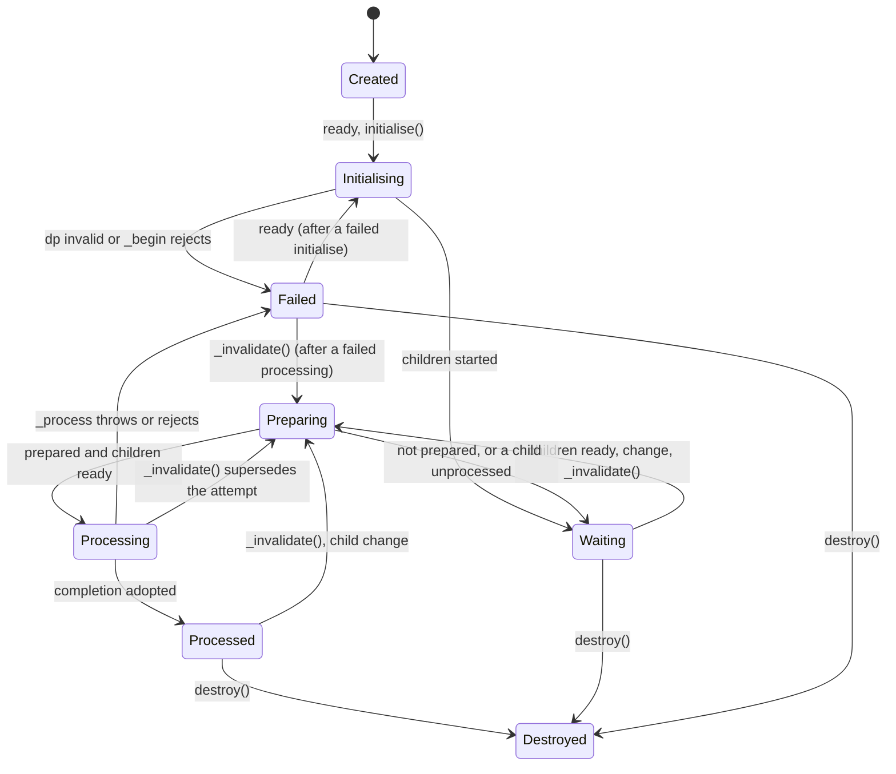

# Dynamic Processor architecture

## Purpose and public surface

A processor owns derived state and the collaborators that decide when it can recompute. The public Beyond module is declared by [main/module.json](../src/modules/main/module.json); its marked exports are `DynamicProcessor`, `DynamicProcessorImplementation`, `IRequest`, `IProcessResponse`, `Listener`, `RequireType` and `ChildrenType`. The internal files behind it are not public modules.

[DynamicProcessor](../src/modules/main/index.ts) is a mixin factory; [DynamicProcessorImplementation](../src/modules/main/dp.ts) owns the lifecycle. The factory allocates one implementation per outer object, forwards the prototype members of the implementation to the outer prototype and redirects the identity and the hooks to the outer subclass; [the mixin guide](../src/modules/main/overloads.md) lists exactly which member goes which way. The outer object is not an `instanceof` the implementation.

The implementation depends on the Node `events` emitter, on `@beyond-js/pending-promise/main` for readiness and on `colors` for the log. Importing the module has no filesystem effect: the [log](../src/modules/main/logs/index.ts) opens its file under `.beyond/dps/` of the working directory the first time something is appended.

## State

| Member | Meaning |
| --- | --- |
| `dp`, `id`, `autoincremented`, `identity` | The kind of processor, a string the subclass must define; its identifier, the process-local counter unless overridden; `identity` is both, readable even when `dp` throws. Diagnostic identities, not cache keys. |
| `self` | The object subscribers registered on: the outer object of a mixin, the implementation otherwise. It is the argument of `change`. |
| `initialising`, `initialised` | `_begin` is running; `_begin` completed and the children were started. Neither means a result exists. |
| `ready` | Starts initialisation when needed. Resolves when a processing completed, rejects when an attempt failed, resolves for a destroyed object. |
| `error`, `failed` | The `ProcessorFailure` of the last attempt, cleared when a new attempt begins. |
| `preparing`, `processing`, `processed` | Preparation in progress; an attempt is in progress; the latest attempt completed and was adopted. A failed processor is neither processing nor processed. |
| `_request`, `cancelled(request)` | The request of the current attempt, or `undefined` while none is current; whether a request is no longer the current one. |
| `tu`, `first` | The time of the last adopted completion; whether the first completion is still to come. |
| `children` | The registered children, the children required by the current preparation, and their monitor. |
| `notifyOnFirst` | Whether `_notify` runs on the first completion. `false` by default; owned by the outer object of a mixin. |
| `destroyed` | Terminal. |

## Lifecycle



**Initialisation.** `initialise()` validates `dp`, runs `_begin()`, marks the object initialised and starts the children. Reading `ready` initialises when needed; calling `initialise()` while it is starting or started returns without joining the first processing. A failure of this phase rejects `ready`, leaves `initialising` and `initialised` false, and a later `ready` tries again. A destruction during `_begin` ends there: the children are not started.

**Preparation.** `#preprocess` marks the object unprocessed and processing, clears the current request, resets the required children and calls `_prepared(require)`. `require(child, id?)` registers the child for this attempt and answers its `processed` flag. Returning `undefined` prepares; `false` holds; a string holds with that reason, which the checkpoint reports. When the set of children changed during preparation, preparation runs again with the new set. When the object is not prepared, or a child is not processed or destroyed, nothing schedules a retry: the children call back through `change`. A `_prepared` that throws fails the attempt.

**Processing.** A prepared attempt allocates a fresh request and calls `_process(request)`. A returned thenable is awaited, whether or not it is a native Promise. A synchronous throw or a rejection fails the attempt, unless the request is no longer current, in which case the failure is only reported. A completion whose request is no longer current is dropped without effect: because the request is cleared when a new attempt begins, this includes the attempt that a newer invalidation superseded while the newer one is still blocked on a child. Nothing cancels the running work and nothing undoes side effects an implementation already performed; `cancelled(request)` after every `await` is what an implementation uses before publishing.

```ts
async _process(request) {
    const next = await this.read();
    if (this.cancelled(request)) return false;
    this.replace(next);
    return { changed: true, notify: true };
}
```

**Completion.** The response decides two flags. `undefined`, `true`, `false` and `null` set both `changed` and `notify` to their truthiness, with `undefined` meaning true; an object sets each one, defaulting to true. The completion records `tu`, clears `processing`, sets `processed`, resolves `ready`, clears `first`, then [announces](../src/modules/main/announcer.ts): `change` is emitted when the result changed or on the first completion, and `_notify()` runs when `notify` is set, except on the first completion unless `notifyOnFirst`. A subscriber or a `_notify` that throws, or a `_notify` whose promise rejects, is reported through the failure report and alters nothing already recorded; the remaining subscribers of the Node emitter after a throwing one are not called, which is the emitter's behaviour. A processing that took more than two seconds is written to the log.

**Failure.** A failed attempt records a `ProcessorFailure` (message `Dynamic processor "<dp>" (id "<id>") failed while <phase>: <reason>`, with the original error as `cause` and the phase as `phase`), rejects the current `ready`, clears `processing` and reports one line on the console and the stack in the log. The readiness promise is created with a no-op rejection handler, so a failure nobody awaits is not an unhandled rejection. No `change` is emitted for a failure: a parent that requires the failed child stays waiting, and its checkpoint names the child and the failure.

**Invalidation.** `_invalidate()` starts a new attempt when the object is initialised and not preparing. It is assigned on the outer object of a mixin, so it works detached. Registering or unregistering children invalidates when asked to.

**Destruction.** `destroy()` clears the request, releases the subscriptions to every child and the checkpoint timer, leaves the registry, resolves a pending `ready`, marks the object destroyed and emits `change` once more. It does not destroy the children, does not remove the object's own subscribers and throws when called twice. Whoever created a child destroys it.

## Children

[Registered](../src/modules/main/children/registered.ts) maps names to `{ child }`; `setup()` registers without invalidating, `unregister()` invalidates unless told not to. A name registered twice with a different child is refused; a child is validated structurally by [validate-child.ts](../src/modules/main/children/validate-child.ts). [Required](../src/modules/main/children/required.ts) holds the children of the current preparation with the identifiers given to `require`. Requiring the processor itself, through the implementation or the outer object, is refused.

[The monitor](../src/modules/main/children/monitor/index.ts) subscribes once to the `change` of every registered or required child, starts a newly monitored child by reading its `ready`, and releases the subscription of a child no longer used. It re-evaluates the parent on every child change: when every child is processed or destroyed and the [controller](../src/modules/main/children/monitor/controller.ts) finds a child request that differs from the previous processing, the parent processes. The controller compares request identities only; it is not a content hash, not a topological sort and not a cycle detector, so a dependency cycle waits until its checkpoint reports it.

[The checkpoint](../src/modules/main/children/monitor/checkpoint.ts) arms an unreferenced five-second timer whenever the parent waits, and writes to the log the reason it is held and every pending child with its state, including `failed: <message>` for a child whose `error` is set. `checkpoint.report` is the same text on demand and `checkpoint.pending` says whether it is armed; `monitor.destroy()` releases it.

## Diagnostics and the log

[Logs](../src/modules/main/logs/index.ts) writes `.beyond/dps/dp-<pid>-<time>.log` under the working directory of the process, opened on the first append; messages appended before it is open are written then, an error opening or writing it is reported once on the console, and `close()` ends the file. It holds failures with their stacks, the reports of throwing subscribers and hooks, slow processings, listener overflow with the processors that require the overflowing one, and the checkpoints. Nothing in it is a physical path of a consumer's evidence: the file name is derived from the process.

The console receives one line per failure and per throwing subscriber or hook, with the identity of the processor and the reason, so a processor nobody awaits is not silent. The failure a consumer receives keeps the original error as `cause`.

## Limits

- `waitToProcess` is declared and inert: invalidations are not debounced.
- A failed child holds its parent; whether a parent should fail instead is a policy decision recorded in [validation](validation.md), not implemented.
- Destroying a processor does not remove the subscribers it holds, and does not destroy its children.
- `on()` reports an emitter that reached its maximum listeners, which is 500 by default, through the log; it does not refuse the subscription.
- The prepared-but-blocked recursion of preparation, when the set of required children keeps changing, has no bound.

## Build and validation

[beyond.json](../beyond.json) selects [src/package.json](../src/package.json), which declares the Node distributions and the public dependencies. The [module tsconfig](../src/modules/main/tsconfig.json) requires Node types. The tests under [tests/](../tests/README.md) import the compiled public module; [validation](validation.md) is the contract-to-test matrix with what remains unverified.
